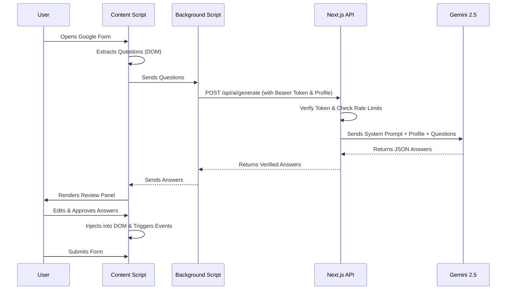
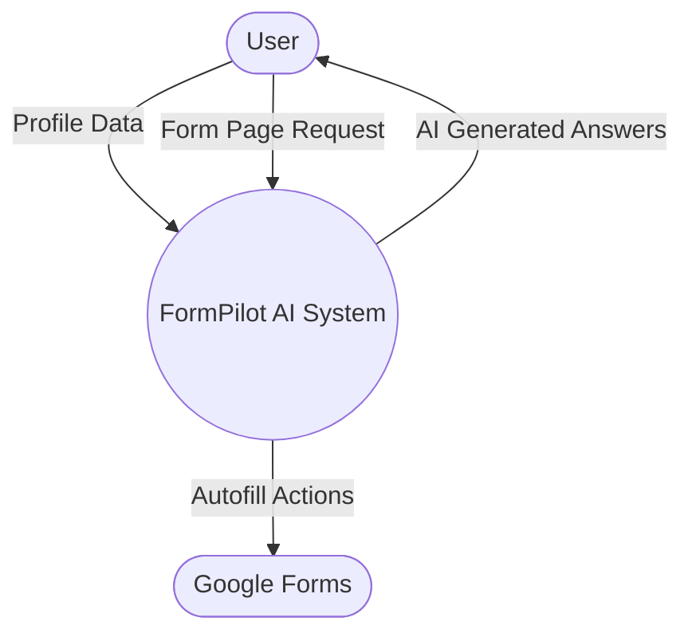
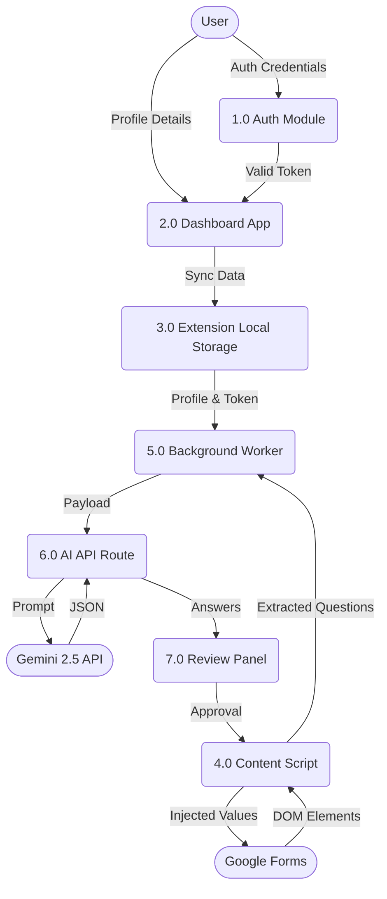
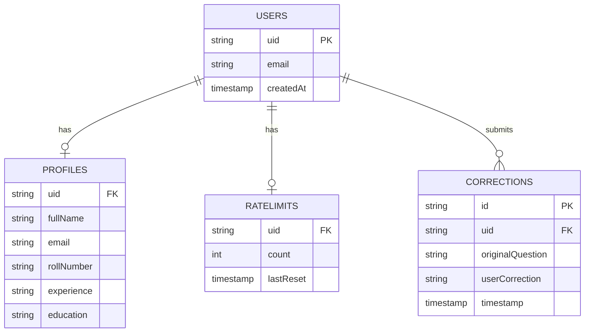
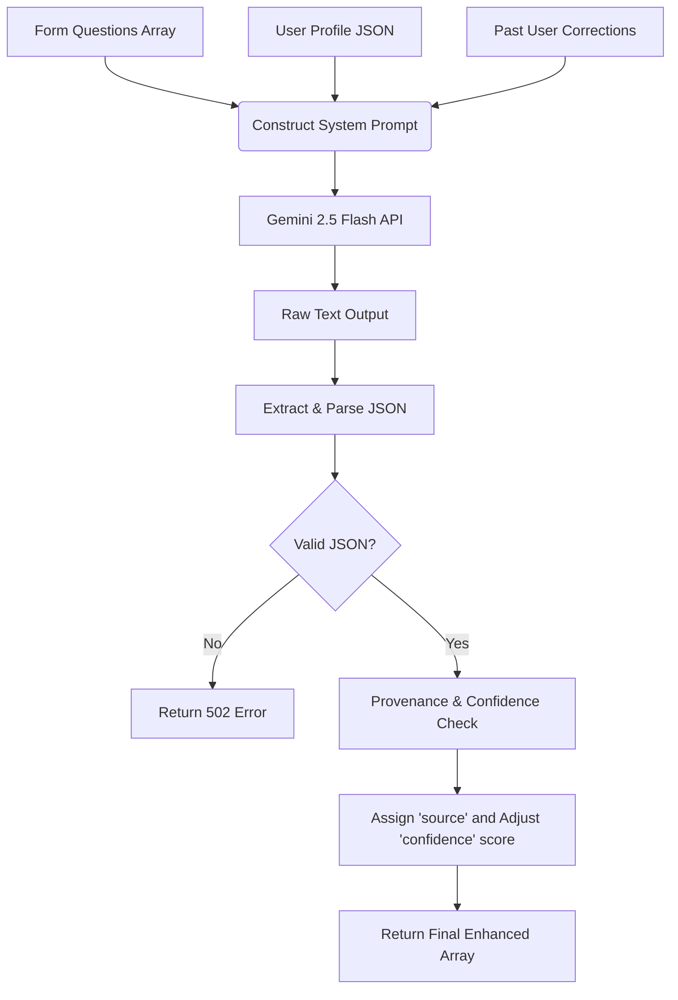

# FormPilot AI
**Intelligent AI-Powered Form Auto-Fill Browser Extension**

**Tagline:** "Fill your profile once. Use it everywhere."

**Project Type:** Browser Extension & Web Dashboard
**Technology Stack:** React 19, Next.js 16, Manifest V3, Firebase v12, Tailwind CSS, Gemini 2.5 Flash

---

## 1. Executive Summary
FormPilot is an intelligent browser extension and web dashboard designed to automate the repetitive process of filling out online forms. Users create and manage a comprehensive personal profile on a web dashboard. When encountering a supported form (currently Google Forms), the extension extracts the questions, uses AI to analyze them in the context of the user's profile, and intelligently maps answers to the form fields. It includes a human-in-the-loop review panel to ensure accuracy before autofilling.

## 2. Problem Statement
Applying to multiple jobs, internships, or college registrations involves repetitive data entry. Users frequently type the same information (name, email, roll number, experience). This process is time-consuming, prone to human error, and mentally fatiguing, especially when dealing with contextual or slightly varied questions across different forms.

## 3. Existing System
Currently, users fill forms manually by:
- Typing repetitive data for each application.
- Copy-pasting from a locally stored text document.
- Relying on basic browser autofill, which often fails on complex, multi-page, or non-standardly named form fields.
- Spending significant time answering contextual questions that could be derived from an existing resume or profile.

## 4. Proposed System
FormPilot offers a centralized profile dashboard and an intelligent extension. The system parses the DOM of the active form, identifies complex structures (like grids and dynamic lists), and matches questions against the cached user profile. If direct mapping isn't sufficient, it leverages a generative AI model (Gemini 2.5 Flash) to construct appropriate answers, which the user can review and approve before automatic insertion into the DOM.

## 5. Project Scope
The scope of FormPilot encompasses:
- A web application (Dashboard) for users to register, log in, and build a comprehensive personal/professional profile.
- A Manifest V3 Chrome extension capable of extracting questions dynamically from Google Forms.
- An AI-powered backend routing system to evaluate form questions against the user profile.
- A user interface injected over forms to review, edit, and approve generated answers.
- Simulated DOM event injection to reliably autofill complex form fields (grids, dropdowns, dates, etc.).
*Out of scope (currently):* Processing non-Google forms, auto-submitting forms without user interaction, and uploading unstructured PDF resumes (Future Scope).

## 6. Project Objectives
- Eliminate redundant manual data entry for job and internship applications.
- Accurately parse dynamic and complex Google Forms structures.
- Use AI to answer contextual questions based on user profiles.
- Maintain data security by keeping profiles tied to authenticated sessions.
- Provide a seamless user review process before injecting data.

## 7. Functional Requirements
1. **User Authentication:** The system must allow users to sign up, log in, and log out securely.
2. **Profile Management:** Users must be able to input, save, and update their personal details, academic history, and professional experience.
3. **Form Detection:** The extension must detect when a user visits `https://docs.google.com/forms/*`.
4. **Data Extraction:** The system must parse the form's DOM and extract questions, including options for MCQs and grids.
5. **AI Processing:** The system must securely send questions and user profiles to the Gemini API and receive mapped answers.
6. **Review Interface:** The extension must display a Review Panel on the form page showing AI-generated answers.
7. **Answer Modification:** Users must be able to edit AI-generated answers before approval.
8. **Autofill Mechanism:** Upon approval, the system must inject answers into the respective input fields and trigger native browser events.

## 8. Non-Functional Requirements
1. **Performance:** The AI answer generation should complete within 3-5 seconds to maintain a seamless user experience.
2. **Security:** User data and authentication tokens must be securely stored. API calls must enforce token verification.
3. **Scalability:** The backend must handle rate limits (currently capped at 1000 requests/day per user) effectively using Firestore.
4. **Usability:** The UI (Dashboard and Review Panel) must be intuitive, modern, and accessible.
5. **Reliability:** The DOM extraction script should fail gracefully if the Google Forms structure changes unexpectedly.

## 9. Key Features
*(Verified from current codebase)*
- **Authentication:** Firebase Auth integration.
- **User Profile:** Dashboard for managing personal data.
- **Browser Extension:** Manifest V3 compatible extension.
- **Google Forms Detection:** Content scripts targeting `https://docs.google.com/forms/*`.
- **Question Extraction:** DOM parsing for various input types.
- **AI Answer Generation:** Integration with Gemini 2.5 Flash.
- **Review Panel:** React-based overlay injected into the page to review/edit AI answers.
- **Autofill:** Programmatic DOM injection into Google Forms inputs.
- **Dashboard Synchronization:** `window.postMessage` bridge between `localhost:3000` and the extension to sync tokens and profiles.
- **Backend/API Integration:** Next.js App Router API endpoints with Firebase Admin for rate-limiting and token verification.

## 10. Detailed Use-Case Descriptions
### Use Case 1: Manage User Profile
- **Actor:** User
- **Pre-condition:** User is logged into the web dashboard.
- **Main Flow:** User navigates to the profile section. User inputs their Name, Email, Date of Birth, Experience, etc. User clicks "Save". Data is stored in Firestore and cached to the extension via `postMessage`.
- **Post-condition:** The updated profile is ready for use by the extension.

### Use Case 2: Autofill a Google Form
- **Actor:** User
- **Pre-condition:** User has an active, authenticated extension and a filled profile.
- **Main Flow:** User opens a Google Form. Extension extracts questions. Extension queries backend for answers. Review Panel appears. User clicks "Fill All". Extension injects data.
- **Post-condition:** The form fields contain the user's data.

### Use Case 3: Review and Edit AI Answers
- **Actor:** User
- **Pre-condition:** Review Panel is displayed with AI suggestions.
- **Main Flow:** User notices an incorrect AI suggestion. User edits the text in the Review Panel. User clicks "Approve/Fill".
- **Post-condition:** The edited answer is injected into the form. The correction is securely sent to the backend to refine future AI generations (few-shot learning).

## 11. Sequence Diagrams

## 12. DFD Level 0 and Level 1
### Level 0 DFD (Context Diagram)

### Level 1 DFD

## 13. Database Architecture Diagram

## 14. Detailed AI Pipeline Diagram

## 15. User Workflow
1. User registration/login on the web dashboard.
2. Create and save profile data.
3. Open a Google Form.
4. FormPilot content script detects the form and extracts questions.
5. Questions and cached profile are sent to the AI API route via the background service worker.
6. AI analyzes questions and generates answers.
7. Review Panel is injected and displayed over the form.
8. User reviews/edits answers.
9. User clicks to autofill approved answers.
10. User manually submits the form.

## 16. Detailed System Architecture
- **Next.js Web Application:** Handles the user dashboard and API routes.
- **React Frontend:** Powers the UI for both the dashboard and the extension's Review Panel.
- **Authentication / Database:** Firebase / Firestore manages user profiles, auth tokens, and rate limits.
- **AI Service:** Google Generative AI (Gemini 2.5 Flash) processes questions.
- **Browser Extension:**
  - **Content Script (`index.tsx`):** Parses Google Forms DOM, extracts questions, and handles autofill injection.
  - **Sync Script (`dashboardSync.ts`):** Listens on the dashboard for auth/profile changes and caches them in extension storage.
  - **Background Worker (`index.ts`):** Manages API communication and token refresh logic.

## 17. Component Architecture
- **Popup:** Simple extension popup interface (HTML/React).
- **Content Script:** `index.tsx` - Injected into Google Forms, reads the DOM, builds a question schema, and renders the Review Panel.
- **Background Service Worker:** `background/index.ts` - Message router, handles authenticated `fetch` requests to the AI backend, and manages token lifecycle.
- **Review Panel:** A React component rendered into a shadow DOM/custom container on the Google Form page to let users approve answers.
- **Dashboard Sync:** `dashboardSync.ts` - Injected into the web app to listen for `FORMPILOT_PROFILE_SYNC` events and cache data.
- **Backend/API:** Next.js Route Handlers (`/api/ai/generate`).
- **Database/Auth:** Firebase Auth for identity, Firestore for rate limits and correction history.

## 18. Extension Architecture
The project utilizes **Manifest V3**.
- **`manifest_version`**: 3
- **Permissions**: `storage` (caching profile/token), `activeTab`, `scripting`.
- **Host Permissions**: `https://docs.google.com/forms/*`, `http://localhost:3000/*`, `http://127.0.0.1:3000/*`.
- **Background Service Worker**: `src/background/index.ts`
- **Content Scripts**: Targeted at Google Forms and local dashboard URLs.
- **Externally Connectable**: Configured for the dashboard domains to allow pinging.

## 19. Google Forms Integration
The content script (`index.tsx`) inspects the Google Forms DOM by looking for `div[role="listitem"]`. It identifies fields by checking for:
- `input[type="text"]`, `email`, `date`, `time`
- `textarea`
- `div[role="radiogroup"]`, `div[role="checkbox"]`
- `div[role="grid"]` (for complex matrix questions)

Autofill is achieved by simulating native events. The extension accesses the property descriptor for `value` on the HTML prototypes and manually dispatches `input`, `change`, and `blur` events.

## 20. AI Prompt / Context Strategy
User profile information is stringified alongside the form questions. The system prompt (`FORMPILOT_SYSTEM_PROMPT`) guides the AI to map profile fields to the questions accurately. Past corrections are appended as context so the model learns from previous manual edits.

## 21. Technologies vs Techniques vs Algorithms
| Category | Item | Description / Purpose |
| :--- | :--- | :--- |
| **Technology** | Next.js 16 | React framework used for building the web dashboard and API endpoints. |
| **Technology** | Firebase | Backend-as-a-Service for Auth and Firestore database. |
| **Technology** | Manifest V3 | The modern extension API framework for Chrome/Edge. |
| **Technique** | Content Script Injection | Running isolated JS in a webpage's context to access and modify its DOM. |
| **Technique** | Prototype Value Manipulation | Overriding React's synthetic event limitations by accessing `Object.getOwnPropertyDescriptor` on native HTML element prototypes to force value updates. |
| **Technique** | Message Passing | Using `window.postMessage` and `chrome.runtime.sendMessage` to securely bridge data between the dashboard and extension. |
| **Algorithm** | Rule-Based DOM Parsing | Iterating over `role="listitem"` blocks to classify question types based on child nodes (O(N) complexity). |
| **Algorithm** | AI Prompt Construction | Dynamically serializing JSON profile data and historical corrections into a strict token-limited prompt template. |

## 22. Testing
*(Verified via local development implementation)*

| # | Test Case | Input / Condition | Expected Result | Actual Result | Status |
| :--- | :--- | :--- | :--- | :--- | :--- |
| 1 | Dashboard Login | Valid credentials | User logged into web app | As Expected | Pass |
| 2 | Invalid Login | Incorrect password | Error message displayed | As Expected | Pass |
| 3 | Extension Sync | Login on localhost:3000 | Extension receives token/profile via postMessage | As Expected | Pass |
| 4 | Storage Cache | Restart browser | Profile remains cached in `chrome.storage.local` | As Expected | Pass |
| 5 | Token Expiration | Wait 1 hour (Firebase token expires) | Background script triggers token refresh flow | As Expected | Pass |
| 6 | Form Detection | Navigate to Google Forms URL | Content script initializes | As Expected | Pass |
| 7 | Extract Short Answer | Text input present in DOM | Classified as `short_answer` | As Expected | Pass |
| 8 | Extract Paragraph | Textarea present in DOM | Classified as `paragraph` | As Expected | Pass |
| 9 | Extract Multiple Choice | `role="radiogroup"` present | Options array extracted | As Expected | Pass |
| 10 | Extract Grid/Matrix | `role="grid"` present | Sub-questions and columns extracted correctly | As Expected | Pass |
| 11 | AI Generation API | Valid Bearer token & Profile | Returns valid JSON array of answers | As Expected | Pass |
| 12 | API Rate Limiting | Exceed 1000 queries/day | API returns 429 status code | As Expected | Pass |
| 13 | Review Panel UI | Receive AI Answers | Panel renders correctly on screen | As Expected | Pass |
| 14 | Answer Editing | User modifies text in Review Panel | Updated state saved locally | As Expected | Pass |
| 15 | Autofill Text | Short answer approval | Native setter and `input` events fired | As Expected | Pass |
| 16 | Autofill Radio | MCQ approval | Clicks corresponding radio DOM element | As Expected | Pass |
| 17 | Autofill Checkbox | Checkbox approval | Selects matching checkboxes, ignores others | As Expected | Pass |
| 18 | Autofill Date | String "YYYY-MM-DD" mapped to date | Injects parsed date into input | As Expected | Pass |
| 19 | Missing Data Handling | Profile lacks required info | Confidence drops, UI highlights missing data | As Expected | Pass |
| 20 | Correction Feedback | User overrides AI answer | Sends POST to `/api/ai/corrections` | As Expected | Pass |

## 23. Current Development Status
- **Completed:** User Authentication, Profile Dashboard, Extension Sync Bridge, Content Script Question Extraction, AI Generation API, Autofill Event Simulation, Basic Rate Limiting.
- **Pending/In Progress:** Error boundary refinements in React, more robust CSS isolation for the Review Panel.
- **Future Scope:** Supporting generic HTML web forms, RAG-based document uploads (PDF parsing), and Firefox extension manifest conversion.

## 24. User Interface Screenshots
*(Visual representations of the FormPilot application)*

**FormPilot Web Dashboard:**

*(Users can manage their profiles and authentication here)*

**Review Panel (Extension UI):**

*(Injected directly into Google Forms, allowing users to review AI answers before autofilling)*

## 25. Security Architecture
- **Authentication:** JWT tokens via Firebase.
- **Environment Variables:** Used for API keys (`GEMINI_API_KEY`).
- **Domain Restrictions:** CORS is explicitly validated against allowed origins and extension protocols.
- **Human-in-the-Loop:** Autofill requires explicit user approval via the Review Panel; nothing is injected silently.

## 26. Limitations
- Currently relies on the specific DOM structure of Google Forms (`div[role="listitem"]`, etc.). Changes to Google Forms UI may break the parser.
- Extension requires the user to log into the web dashboard first to fetch the profile.
- Rate limited to 1000 AI requests per day per user.

## 27. Team Module Division
- **Frontend / Dashboard Module:** Next.js architecture, UI/UX, Profile Management.
- **Extension / DOM Module:** Content scripts, DOM extraction, Autofill logic.
- **Backend / AI Module:** API routing, Firebase security, Gemini prompt engineering, Rate limiting.

## 28. Conclusion
FormPilot successfully integrates modern browser extension capabilities with Generative AI and a robust backend framework. By offloading repetitive data entry to an intelligent, human-reviewed system, it solves a widespread productivity bottleneck for job seekers and students.

## 29. Viva Preparation: Important Questions
**Q: Why did you choose a browser extension?**
A: Extensions provide direct access to the DOM of third-party websites, which is necessary to read form questions and programmatically inject answers without requiring the target website's cooperation.

**Q: How does the extension communicate with the website?**
A: We use a content script injected into the dashboard that listens to `window.postMessage` events and forwards the payload to the extension's background worker via `chrome.runtime.sendMessage`.

**Q: How does AI generate answers?**
A: The extension sends the parsed questions and user profile to our Next.js backend. The backend securely queries Gemini 2.5 Flash, feeding it a system prompt that maps the profile data to the specific contextual questions.

**Q: How is user data protected?**
A: Data is tied to authenticated Firebase sessions. API routes require Bearer tokens. Crucially, the extension never autofills data silently; the Review Panel mandates human approval.

## 30. References / Resources
1. **React Documentation:** https://react.dev/
2. **Next.js App Router Documentation:** https://nextjs.org/docs
3. **Chrome Extension Manifest V3 Concepts:** https://developer.chrome.com/docs/extensions/mv3/
4. **Google Gemini API Documentation:** https://ai.google.dev/docs
5. **Firebase Web Setup:** https://firebase.google.com/docs/web/setup
6. **MDN Web Docs (DOM Events):** https://developer.mozilla.org/en-US/docs/Web/Events
